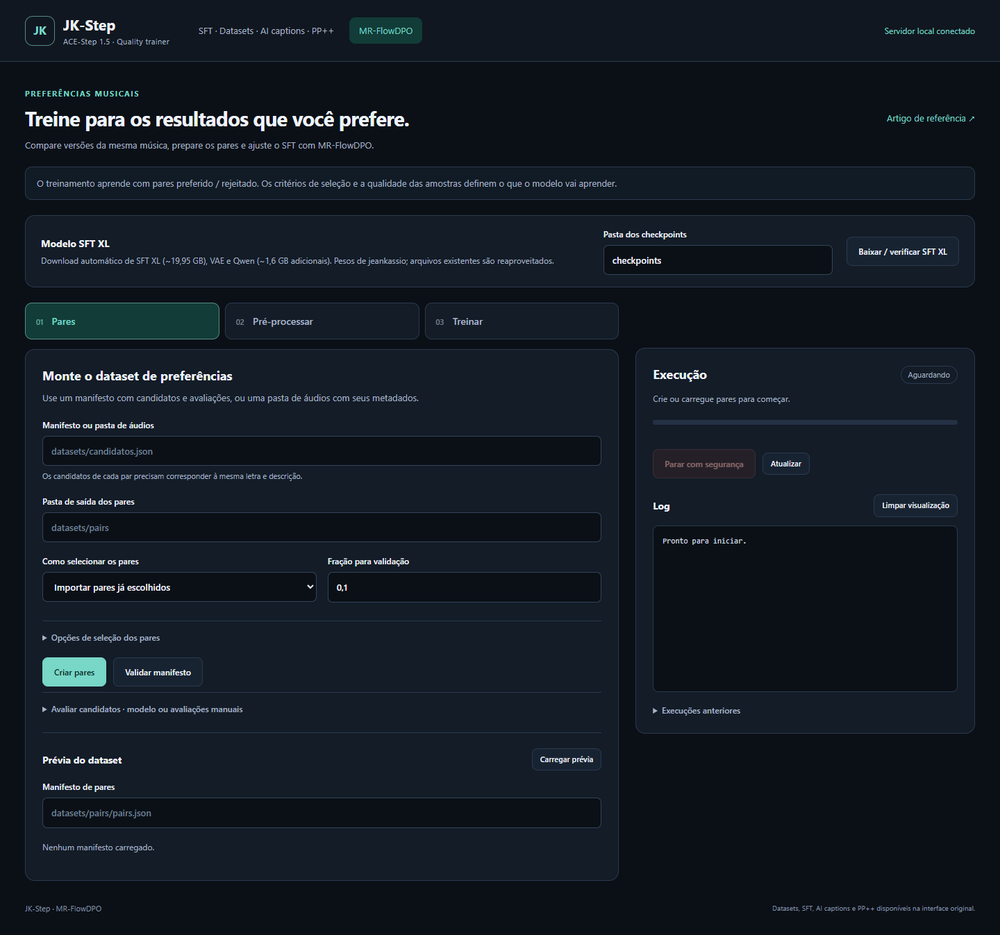

# JK-Step MR-FlowDPO

[English](README.md) · **Português (Brasil)** · [Español](README_ES.md)

Treinador de LoRA supervisionado e por preferências para **ACE-Step 1.5 SFT e SFT XL**, com linha de comando, interface local no navegador e ferramentas de dataset derivadas do [Side-Step](https://github.com/koda-dernet/Side-Step). O fluxo padrão da interface começa com **uma pasta de músicas** e prepara automaticamente descrições, letras, trechos, JSON e tensores de treinamento.

O objetivo é investigar qualidade musical e acústica geral preservando a fidelidade da letra. Você pode criar datasets a partir de gravações existentes; **não é necessário gerar músicas com Turbo**. O adapter modifica o próprio modelo de geração, sem aplicar masterização, equalização ou outra pós-produção às músicas geradas.



**Estado da pesquisa:** o modo por preferências é uma adaptação experimental do [MR-FlowDPO](https://arxiv.org/abs/2512.10264) para ACE-Step. O artigo avaliou geração instrumental com outros modelos de flow matching. O modo SFT usa flow matching supervisionado normal, sem comparações de preferência. Os testes verificam que o treinador executa, atualiza o LoRA e congela o base; eles não comprovam melhoria musical nem garantem preservação da pronúncia. Veja os [resultados de validação](docs/VALIDATION.md).

## Recursos incluídos

- Preparação de pasta até LoRA: descrições locais Qwen2.5-Omni-7B, letras/timestamps Whisper large-v3, trechos, JSON e tensores. Escolha preferências MR-FlowDPO automáticas ou SFT normal. A UI não exige músicas Turbo, Genius/chave de API ou JSON escrito manualmente.
- Pares MR-FlowDPO automáticos comparam cada trecho existente com cópias degradadas por lowpass, ruído ou clipping. Essas comparações sintéticas ensinam a evitar defeitos específicos; não estabelecem preferências gerais de qualidade musical nem reproduzem os rewards MRSD do artigo.
- SFT com um único alvo e loss de flow matching mascarada em FP32, validação por grupos antes das repetições e suporte a uma ou várias GPUs no mesmo motor de checkpoint, retomada e exportação.
- Objetivo Flow-DPO real, com o SFT original congelado como referência, sem manter uma segunda cópia do XL em cada GPU.
- Rank, alpha, dropout, rsLoRA, ajustes por módulo, camadas do decoder, self/cross attention e alvos MLP configuráveis.
- Seleção de pares por múltiplas recompensas, importação humana, degradações controladas, pré-processamento compartilhado e caches de tensores.
- Configuração por flags CLI, JSON ou UI; monitoramento, cancelamento, checkpoints, retomada e exportação ComfyUI.
- Organização de datasets, captions, letras, sidecars, análise de áudio, stems, PP++ e ferramentas de treino supervisionado herdadas do Side-Step. Algumas integrações exigem pacotes opcionais, credenciais de API ou outros modelos.
- Download automático do SFT XL puro padrão e dos modelos de pré-processamento, no ambiente e pasta de checkpoints deste treinador.

## Instalação

### Windows

1. Clone ou extraia o repositório em uma pasta gravável.
2. Execute `install_windows.bat`. Ele cria `.venv`, instala dependências e baixa os modelos padrão.
3. Execute `start_ui.bat`. A interface abre em `http://127.0.0.1:8771` com um token de sessão.

Não é necessário ser administrador nem instalar ComfyUI. O instalador usa um ambiente Python próprio e não atualiza bibliotecas do ComfyUI.

```powershell
.\jk-step.bat doctor
.\jk-step.bat --help
.\jk-step.bat train --help
```

O ambiente verificado usa Python 3.12, PyTorch 2.10, CUDA 12.8 e TorchCodec 0.10. [constraints.txt](constraints.txt) fixa as versões de dependências verificadas.

| Opção do instalador | Efeito |
| --- | --- |
| `install_windows.bat -CoreOnly` | Instala treinador/UI e o fluxo local de descrições/transcrição da pasta, sem integrações opcionais de APIs remotas, separação de stems e interface no terminal. |
| `install_windows.bat -Rewards` | Instala também os avaliadores opcionais CLAP e Audiobox. |
| `install_windows.bat -SkipModels` | Pula os modelos; use arquivos locais ou execute `models setup` depois. |
| `install_windows.bat -Backend cpu` | Instala PyTorch CPU para desenvolvimento ou testes pequenos. Treinar XL na CPU é lento. |

A preparação de pasta decodifica com SoundFile e usa o executável `imageio-ffmpeg` fornecido quando necessário; esse fluxo padrão não exige configurar FFmpeg externo. Funções opcionais do toolkit herdado que usam TorchCodec ainda podem exigir bibliotecas compartilhadas FFmpeg compatíveis; veja as [instruções oficiais do TorchCodec](https://github.com/meta-pytorch/torchcodec#compatibility-with-torch-versions).

### Linux

Instale [uv](https://docs.astral.sh/uv/getting-started/installation/) e execute:

```bash
bash install_linux.sh
bash jk-step.sh doctor
bash jk-step.sh gui
```

`JK_BACKEND=cpu` seleciona os pacotes CPU; `JK_SKIP_MODELS=1` pula os modelos. Há instaladores para Windows e Linux. O motor aceita dispositivos MPS, mas o treinamento XL não foi validado em macOS.

### Armazenamento e memória da GPU

Reserve aproximadamente **22 GB para os modelos ACE de geração/pré-processamento**, além do ambiente, áudios, cache, adapters e downloads adicionais de Qwen para descrições e Whisper para transcrição no fluxo de pasta. O SFT XL sozinho ocupa cerca de 20 GB. O nome de arquivo padrão Hugging Face é criado por hardlink quando possível; outros sistemas de arquivos podem precisar de uma cópia adicional de aproximadamente 20 GB para compatibilidade com o toolkit.

Uma RTX 3090 de 24 GB foi usada nos testes de execução. A VRAM real depende do crop, batch, rank, camadas e precisão. Comece com batch 1, precisão mista, offload e gradient checkpointing. O padrão usa GPU 0; você pode selecionar outro dispositivo compatível, como `--device cuda:1` ou `--device cpu`.

## Modelos

```powershell
# O instalador padrão já realiza esta etapa.
.\jk-step.bat models setup --checkpoint-dir checkpoints
```

| Componente | Origem |
| --- | --- |
| Pesos SFT XL puro | [jeankassio/acestep_v1.5_sft_xl](https://huggingface.co/jeankassio/acestep_v1.5_sft_xl), na revisão fixada e registrada pelo aplicativo. |
| Arquitetura, configuração e silêncio correspondentes | [ACE-Step/acestep-v15-xl-sft](https://huggingface.co/ACE-Step/acestep-v15-xl-sft), com revisão fixada separadamente. |
| VAE e Qwen3-Embedding-0.6B | [ACE-Step/Ace-Step1.5](https://huggingface.co/ACE-Step/Ace-Step1.5), com a revisão resolvida registrada localmente. |
| Descrições locais da pasta | [Qwen/Qwen2.5-Omni-7B](https://huggingface.co/Qwen/Qwen2.5-Omni-7B), baixado quando necessário para anotar os áudios. |
| Letras/timestamps locais | [openai/whisper-large-v3](https://huggingface.co/openai/whisper-large-v3), baixado quando necessário para transcrição. |

Os downloads podem ser retomados e arquivos completos são reutilizados. A preparação de pasta baixa automaticamente modelos de anotação e ACE ausentes quando os downloads estão habilitados. Esse fluxo não precisa de checkpoint Turbo/Merge, LM gerador de músicas, token Genius ou API remota de descrições/transcrição. Modelos de avaliação/toolkit são downloads extras.

Para usar um safetensors existente, configure `checkpoint_file` e seu `model_config_dir` correspondente. Os nomes e formatos dos parâmetros são conferidos antes da alocação. `--no-auto-download` desativa o download automático padrão. Diretórios Hugging Face podem usar `checkpoint_dir` e `model_variant` (`xl-sft`, `sft`, `xl-base` ou `base`). Este motor não habilita treino por preferências do Turbo destilado.

## Interface e ferramentas de dataset

```powershell
.\jk-step.bat gui
# Opcional: outra porta, sem abrir o navegador automaticamente.
.\jk-step.bat gui --port 8772 --no-browser
```

Use o seletor de idioma da interface para escolher **English**, **Português** ou **Español**. O navegador salva essa preferência. Ela muda os textos da interface, independentemente do idioma das letras/transcrição (`auto`, `pt`, `en`, `es` etc.); uma interface em inglês pode preparar músicas em português.

A página principal abre na preparação de pasta com MR-FlowDPO selecionado. SFT normal é outra opção da pasta. Dataset, Preparar e Treinar reúnem seleção, preparação automática, revisão, configuração, logs e cancelamento. Importar pares humanos e selecionar candidatos avaliados continuam disponíveis separadamente. O toolkit abre organização de áudios, sidecars, captions/letras, análise, stems, PP++ e ferramentas herdadas de adapters.

```powershell
.\jk-step.bat toolkit --help
.\jk-step.bat toolkit dataset --help
.\jk-step.bat toolkit captions --help
.\jk-step.bat toolkit preprocess --help
```

`sidestep` permanece como alias de compatibilidade de `toolkit`. [UPSTREAM.md](UPSTREAM.md) preserva a documentação histórica e os créditos; [docs/toolkit](docs/toolkit) contém os guias herdados. O pacote Python atual é `jk_engine`; sua entrada opcional de interface no terminal é `jk_step_tui.py`.

## Início rápido: pasta de músicas até LoRA

1. Abra `start_ui.bat`. Em **Dataset**, escolha a pasta e o objetivo: **MR-FlowDPO** automático ou **SFT** normal.
2. Clique em **Preparar dataset**. O aplicativo baixa modelos ausentes, anota os áudios localmente, prepara trechos com a letra correspondente e grava dataset/tensores fora dos originais.
3. Em **Preparar**, revise captions/letras das amostras e itens excluídos. Transcrições de canto e timestamps automáticos podem conter erros.
4. Continue em **Treinar**. O manifesto correto e o preset são preenchidos automaticamente; escolha uma saída nova, ajuste as opções e inicie o LoRA.

MR-FlowDPO usa `conservative`: rank 32, alpha 64, LR `1e-6`, beta 100, regularização FM do escolhido 0.1, batch 1, acumulação 8 e duas épocas. A pasta mantém os trechos preparados completos (`max_latent_length=0`, dropout CFG 0). As comparações mistas padrão incluem lowpass, ruído e clipping; são defeitos artificiais conhecidos, não avaliações humanas da composição.

SFT normal usa `sft_lora`: rank 32, alpha 64, LR `1e-5`, batch 1, acumulação 4, 100 épocas, warmup 50, dropout CFG 0.1 e `max_latent_length=0`. São valores iniciais editáveis, não ótimos comprovados. `sft_rank64` oferece rank 64/alpha 128. A opção de conteúdo permite voz, instrumentais ou detecção automática.

O mesmo fluxo está disponível no ambiente ativado do projeto:

```powershell
python -m jk_step dataset inspect --audio-dir "E:/Minhas músicas"

# MR-FlowDPO automático; use pairs_manifest retornado no resultado final.
python -m jk_step dataset prepare --audio-dir "E:/Minhas músicas" --output datasets/minhas_musicas_mr --objective flow_dpo
python -m jk_step train --preset conservative --pairs-manifest "<pairs_manifest retornado>" --max-latent-length 0 --output-dir output/meu_lora_mr

# Alternativamente, SFT normal com alvo único.
python -m jk_step dataset prepare --audio-dir "E:/Minhas músicas" --output datasets/minhas_musicas --objective sft
python -m jk_step config --preset sft_lora --output configs/meu_sft.json
python -m jk_step train --config configs/meu_sft.json --dataset-manifest datasets/minhas_musicas/supervised_manifest.json --output-dir output/meu_lora_sft
```

Use os caminhos reais retornados: **`pairs_manifest` para MR-FlowDPO**, **`dataset_manifest` para SFT**. Ambos gravam anotações em `dataset.json`; somente SFT grava `supervised_manifest.json`, sem scores ou áudio rejeitado. MR automático cria cópias com degradações controladas e tensores pareados, sem exigir JSON manual de pares. O guia em [Português](docs/FOLDER_TO_LORA_PTBR.md), [English](docs/FOLDER_TO_LORA.md) ou [Español](docs/FOLDER_TO_LORA_ES.md) explica opções, letras revisadas, limites, várias GPUs, retomada e ComfyUI.

Um teste funcional limitado concluiu a preparação de pasta com modelos locais de anotação, JSON/tensores, treino SFT iniciado pela UI e exportação do adapter. Outro teste MR automático preparou três pares controlados de áudio em português, codificou ambos os lados, executou uma atualização Flow-DPO real e exportou pesos finitos. Duas RTX 3090 foram usadas em outro teste de execução SFT. Esses testes verificam funcionamento e arquivos salvos; não medem melhoria audível, precisão da letra ou desempenho em datasets arbitrários.

## Preparar datasets de preferências

Cada par contém uma gravação **escolhida** e outra **rejeitada**, representando a mesma intenção de caption e letra. Mantenha os começos alinhados e as durações iguais. O escolhido precisa realmente ser melhor nos critérios que você deseja ensinar.

Forneça as palavras exatas cantadas, uma caption musical útil e metadata correta. Não rotule uma música cantada como `[Instrumental]`. Confira captions/transcrições automáticas. Para um adapter de qualidade geral, varie gêneros, idiomas, cantores, andamentos, instrumentos e arranjos. Um dataset restrito pode continuar ensinando um estilo restrito.

### Pares escolhidos por humanos

Edite [configs/pair_import.example.json](configs/pair_import.example.json) e importe. Os caminhos são resolvidos a partir da pasta do manifest. `group_id` identifica a gravação/prompt; `holdout_group` pode identificar um artista ou grupo maior de validação. `pair_weight` controla opcionalmente o peso do par no treino.

```powershell
.\jk-step.bat pairs build --input configs/pair_import.example.json --output datasets/human_pairs --options configs/import.example.json
```

Evite que variações da mesma gravação ou artista apareçam simultaneamente em treino e validação.

### Seleção por múltiplas recompensas de candidatos existentes

Crie um modelo de avaliação manual, agrupe candidatos comparáveis, preencha scores e aplique MRSD:

```powershell
.\jk-step.bat pairs score --input my_audio --output datasets/scores.json --template
.\jk-step.bat pairs build --input datasets/scores.json --output datasets/mrsd --options configs/mrsd.example.json
```

O exemplo usa alinhamento com texto, qualidade de produção e consistência semântica, além de `lyric_fidelity` protegido. Preencha todos os valores ou configure explicitamente menos eixos. Scores ausentes não são inventados. A seleção exige melhora forte no eixo primário, melhora nos demais eixos selecionados e restrições dos eixos protegidos; quantis, pisos de qualidade, filtros de valores extremos e balanceamento são configuráveis.

Os avaliadores automáticos opcionais incluem CLAP musical e Audiobox Production Quality. A recompensa semântica do artigo exige HuBERT treinado em música e centroides compatíveis; eles não estão incluídos. Forneça recursos compatíveis ou scores manuais/pré-calculados. CLAP mede associação entre áudio/texto, não cada palavra cantada.

```json
{"providers":["clap","audiobox"],"allow_download":true,"device":"cuda:0"}
```

Salve as opções em JSON e passe o arquivo em `pairs score --options`. Dois scores automáticos sozinhos não preenchem todos os eixos do exemplo de três recompensas.

### Pares acústicos controlados

```powershell
.\jk-step.bat pairs build --input my_audio --output datasets/acoustic_pairs --options configs/degraded.example.json
```

O gerador oferece comparações rotuladas com lowpass, ruído, clipping e lowpass do vocal. Degradar somente a voz exige stems vocais alinhados e `vocal_stems_dir`; filtrar a mix completa não isola seu cantor.

Essas comparações são uma experiência de qualidade acústica, não prova de composição melhor nem de que o problema vocal SFT foi resolvido. As degradações preparam exemplos de treinamento, sem pós-produção das músicas geradas.

### Fontes de dataset

Você pode usar gravações próprias/licenciadas. O catálogo integrado também aponta para:

| Fonte | Conteúdo e uso relevantes |
| --- | --- |
| [JamendoLyrics PT](https://huggingface.co/datasets/Felipehonorato/pt_it_jamendolyrics) | 20 músicas originais em português com letras completas revisadas; licenças por faixa, sem timestamps. |
| [Anotações MulJam PT](https://github.com/weAreMusicAI/alt-datasets-interspeech2025) | Quatro músicas adicionais em português com tempos por linha; importação em trechos alinhados. A fonte MTG exige pesquisa não comercial/acadêmica. |
| [Muse](https://huggingface.co/datasets/bolshyC/Muse) | Músicas Suno V5 existentes com letras/estilos; exige curadoria e preferências. O card declara MIT. |
| [MUSDB18-HQ](https://sigsep.github.io/datasets/musdb.html) | Músicas reais com stems vocais/instrumentais alinhados; útil para comparações vocais. O acesso acadêmico é solicitado; forneça letras separadamente. |
| [MTG-Jamendo](https://github.com/MTG/mtg-jamendo-dataset) | Faixas completas com tags de gênero/instrumento/humor. A fonte especifica pesquisa não comercial/acadêmica e licenças por faixa. |
| [JamendoLyrics](https://huggingface.co/datasets/jamendolyrics/jamendolyrics) | Benchmark de canto com palavras alinhadas; preserve avaliação externa ao medir dicção. |

```powershell
.\jk-step.bat sources
# Baixa somente o arquivo selecionado, não o dataset inteiro.
.\jk-step.bat sources --download bolshyC/Muse --file en_part01_of_35.tar --output datasets/downloads/muse
```

Esse arquivo Muse ocupa aproximadamente 11 GB. Os arquivos não são extraídos ou convertidos universalmente em captions/letras de forma automática. Siga o layout da fonte e importe os áudios/metadata pelo toolkit. Consulte as [notas de dataset](docs/DATASETS.md).

Para o conjunto inicial em português (24 músicas existentes, cerca de 146 MB de MP3 mais anotações), execute:

```powershell
.\.venv\Scripts\python.exe scripts/download_portuguese_datasets.py
.\.venv\Scripts\python.exe scripts/import_jamendolyrics_pt.py --root datasets/downloads/jamendolyrics_pt --output datasets/jamendolyrics_pt --license-filter all
.\.venv\Scripts\python.exe scripts/import_muljam_pt.py --annotations datasets/downloads/musicai_interspeech2025/dali_muljam_interspeech25.csv --metadata datasets/downloads/muljam_pt/audio_metadata.json --output datasets/muljam_pt
```

No Linux, use `.venv/bin/python`. Os importadores preservam letras, hashes e licenças; os trechos alinhados são gravados em FLAC ou WAV FLOAT32, sem mudar ganho nem sample rate. A letra de uma música inteira não deve acompanhar um recorte curto arbitrário. Esses arquivos são amostras de origem, não preferências MRSD naturalmente ranqueadas. Consulte o [guia dos datasets em português](docs/PORTUGUESE_DATASETS.md) sobre o piloto e suas limitações.

O [guia de preparação do dataset de qualidade PT/EN](docs/QUALITY_DATASET_PREPARATION_PTBR.md) cobre alinhamento forçado experimental em português, seções inteiras do Muse, combinação de amostras únicas e balanceamento das referências PT após pré-processar cada par uma vez.

## Validar, pré-processar e treinar

Execute na pasta do projeto, usando os manifests retornados pela criação dos pares:

```powershell
.\jk-step.bat pairs validate --manifest datasets/acoustic_pairs/pairs.json
.\jk-step.bat pairs preprocess --manifest datasets/acoustic_pairs/pairs.json --checkpoint-dir checkpoints --output datasets/tensors
.\jk-step.bat pairs validate --manifest datasets/tensors/pairs.preprocessed.json --check-tensors

.\jk-step.bat config --preset conservative --output configs/my_training.json
.\jk-step.bat train --config configs/my_training.json --pairs-manifest datasets/tensors/pairs.preprocessed.json --output-dir output/my_quality_lora
```

O pré-processamento armazena tensores alinhados de VAE, texto/letra e condicionamento ACE. Ambos os lados compartilham condicionamento e recebem o mesmo crop. A média do posterior VAE é padrão e a normalização de áudio vem desativada. Fingerprints acompanham mudanças nas fontes/configurações para reutilizar tensores compatíveis.

O padrão `context_mode=chosen_semantic` extrai códigos da **gravação existente escolhida** e compartilha seu plano detokenizado com ambos os lados. Não gera músicas Turbo/LM. `context_mode=silence` usa texto/letra padrão sem esse plano. Em candidatos independentes com melodias diferentes, o plano só do vencedor pode enviesar comparações; prefira silêncio quando não houver justificativa para um plano compartilhado. Passe ajustes do pré-processamento como JSON em `--options`.

O preset `conservative` começa com rank 32, alpha 64, LR `1e-6`, beta 100, regularização FM 0.1, batch 1, acumulação 8 e duas epochs. São valores de experiência inicial, não ótimos ACE-Step comprovados. `paper_beta` expõe beta 2000 do setup do artigo.

```powershell
# Campos de treinamento disponíveis por flags, JSON e interface.
.\jk-step.bat train --config configs/my_training.json --rank 64 --alpha 128 --layers 0-15 --learning-rate 0.000001 --pairs-manifest datasets/tensors/pairs.preprocessed.json --output-dir output/rank64
```

As opções CLI prevalecem sobre o JSON carregado. `--set KEY=VALUE` aceita valores JSON; nomes incorretos ou opções desconhecidas são rejeitados.

| Área | Controles configuráveis |
| --- | --- |
| Adapter | Rank/alpha/dropout, rsLoRA, rank/alpha por módulo, projeções, camadas, self/cross attention e MLP. |
| Objetivo | `sft`: flow matching com um alvo. `flow_dpo`: beta, regularizações FM do escolhido/velocidade da referência, label smoothing e peso dos pares. Timesteps contínuos e dropout CFG se aplicam aos dois. |
| Otimização | Batch/acumulação, epochs ou passos máximos, AdamW/AdamW8bit/Adafactor, LR, weight decay/momentos, warmup, scheduler constante/linear/cosseno e clipping. |
| Hardware/dados | Dispositivo, precisão, offload, gradient checkpointing, workers, seeds, crops, repetições, conferência do cache e validação por grupo. |
| Saídas | Frequência de avaliação/logs, TensorBoard, frequência/retenção de checkpoints, retomada, inicialização por adapter e exportação ComfyUI. |

No Flow-DPO, batch conta **pares**, cada um com duas branches de áudio, e a referência congelada adiciona uma passagem. No SFT, conta **exemplos de áudio individuais**, sem passagem de referência. Acumular aumenta o batch efetivo sem manter todas as ativações GPU. Pacotes opcionais de optimizer devem estar instalados; o toolkit herdado também oferece outras opções de optimizer/adapters.

### Treinamento multi-GPU experimental

```powershell
.\jk-step.bat train --config configs/my_training.json --pairs-manifest datasets/tensors/pairs.preprocessed.json --output-dir output/two_gpus --multi-gpu --gpu-ids 0,1 --distributed-backend auto
```

`batch_size` é por GPU. O batch efetivo é `batch_size × gradient_accumulation × número_de_GPUs`. Cada GPU mantém uma réplica do decoder; **duas placas de 24 GB não viram uma memória única de 48 GB**. O crop e o adapter precisam caber em cada placa individualmente.

No Linux, a seleção automática usa NCCL para comunicação GPU. No Windows, usa o backend `local` integrado: os workers comunicam gradientes LoRA pela memória CPU e por um gerenciador de multiprocessing, sem exigir Gloo ou NCCL. O backend opcional `gloo` continua disponível para builds do PyTorch que o suportam. O desempenho depende do hardware/interconexão e da comunicação. A validação e seus limites estão em [VALIDATION.md](docs/VALIDATION.md); suporte experimental não é garantia de aceleração. A interface expõe as opções correspondentes de hardware.

## Checkpoints, parada e ComfyUI

As saídas incluem `training_config.json`, `metrics.jsonl`, eventos TensorBoard opcionais, checkpoints e adapters PEFT. A pasta final contém `adapter_model.safetensors`, `adapter_config.json` e `training_state.pt`; `latest.json` registra os caminhos reais.

```powershell
# Continua o mesmo treino com sua configuração salva.
.\jk-step.bat train --config output/my_quality_lora/training_config.json --resume-from output/my_quality_lora/checkpoint-00000100

# Exporta um adapter existente, preservando seu scaling efetivo.
.\jk-step.bat export --adapter output/my_quality_lora/final --output output/quality.safetensors --target native
```

A retomada restaura optimizer, scheduler, scaler, RNG, epoch e cursor do dataset. Mudanças incompatíveis no modelo/dados/configuração são rejeitadas. `init_adapter` inicia outra experiência com pesos existentes compatíveis; rank/alpha/dropout/rsLoRA precisam corresponder ao adapter. Use uma pasta nova para um treino novo.

Ctrl+C na CLI ou Parar na UI solicita parada cooperativa na fronteira de atualização do optimizer e salva `stopped`. Um kernel GPU ativo não pode ser interrompido instantaneamente.

Com `export_comfyui=true`, a conclusão também salva `quality_comfyui.safetensors`. A exportação preserva scaling efetivo por módulo, incluindo rsLoRA e alpha personalizado. Use `native` para o mapeamento ACE específico do ComfyUI ou `generic` quando seu loader exigir. Aplique o LoRA na família SFT usada para treinar e compare forças; no Turbo não há comportamento equivalente implícito.

## Método e limites de avaliação

Com `objective=sft`, o treinador aprende a velocidade de flow da gravação individual (`noise - target_latents`) a partir de uma interpolação ruidosa, com erro quadrático mascarado em FP32. Somente os pesos LoRA do decoder treinam. Trechos vocais preparados não podem ser encurtados aleatoriamente mantendo a letra completa. `beta`, regularizações de preferência, smoothing e pesos de pares não têm efeito no SFT.

Com `objective=flow_dpo`, o objetivo principal para cada par escolhido/rejeitado é:

```text
softplus(beta * ((erro_escolhido - erro_rejeitado)
               - (erro_ref_escolhido - erro_ref_rejeitado)))
```

Os erros são de velocidade, calculados em FP32 com máscaras. Ruído, timestep, caption, letra, contexto e dropout pareado são compartilhados. A inferência da referência desativa adapters e gradientes; somente LoRA do decoder é atualizado. A convenção ACE de velocidade, de dados para ruído, é usada consistentemente.

Isso implementa Flow-DPO e seleção por múltiplas recompensas, com adaptações ACE explícitas. **O reward prompting numérico do artigo não foi implementado.** Acrescentar `quality=10` à caption não o reproduz. Os resultados do artigo não podem ser transferidos diretamente a este modelo de canto ou datasets arbitrários. Consulte o [artigo](https://arxiv.org/abs/2512.10264), [código dos autores](https://github.com/lonzi/mrflow_dpo) e [notas de treino](docs/TRAINING.md).

Loss menor ou margem melhor não comprovam música audivelmente melhor. Avalie músicas/artistas/idiomas/prompts externos com as mesmas seeds e condições, comparando SFT com/sem LoRA. Julgue separadamente clareza, artefatos, naturalidade, harmonia, ritmo e palavras cantadas. Transcrição de canto exige revisão humana. Congelar o base ou filtrar fidelidade da letra não garante pronúncia igual depois de treinar.

## Desenvolvimento e distribuição

```text
jk_step/          Motor SFT/preferências, fluxo de pasta, CLI, UI e modelos
jk_engine/        Toolkit de dataset/supervisão adaptado do Side-Step
frontend/         Arquivos da interface no navegador
configs/          Presets e exemplos de pares
docs/             Método, datasets, validação e guias herdados
scripts/          Empacotamento e testes de execução
tests/            Testes automatizados
UPSTREAM.md       README histórico do projeto original
```

```powershell
.venv\Scripts\python.exe -m pip install pytest httpx
.venv\Scripts\python.exe -m pytest -q tests
.venv\Scripts\python.exe scripts/package_release.py
```

O ZIP de distribuição exclui ambientes, modelos, datasets, saídas, tokens e sessões. Distribua fonte/instaladores em vez de caches locais ou `.venv`. É possível criar uma wheel com `uv build --wheel`; para o toolkit standalone completo, use repositório/ZIP de fonte e instaladores.

## Créditos e licença

JK-Step MR-FlowDPO é uma distribuição modificada do **[Side-Step](https://github.com/koda-dernet/Side-Step), de koda-dernet**, ampliada com treino ACE por preferências, criação/avaliação de pares, nova interface/CLI, preparação de modelos e documentação. A licença herdada é **[CC BY-NC-SA 4.0](LICENSE)**. Preserve [NOTICE.md](NOTICE.md), a licença e a atribuição ao redistribuir; essa licença não concede uso comercial.

Arquitetura/runtime e modelos ACE vêm de [ACE-Step 1.5](https://github.com/ace-step/ACE-Step-1.5). O SFT XL puro é baixado de [jeankassio/acestep_v1.5_sft_xl](https://huggingface.co/jeankassio/acestep_v1.5_sft_xl). O objetivo segue as equações do [MR-FlowDPO](https://arxiv.org/abs/2512.10264); esta é uma adaptação ACE, não o treinador Audiocraft dos autores. Dependências, pesos e datasets conservam suas licenças. Não há endosso implícito dos projetos originais.
